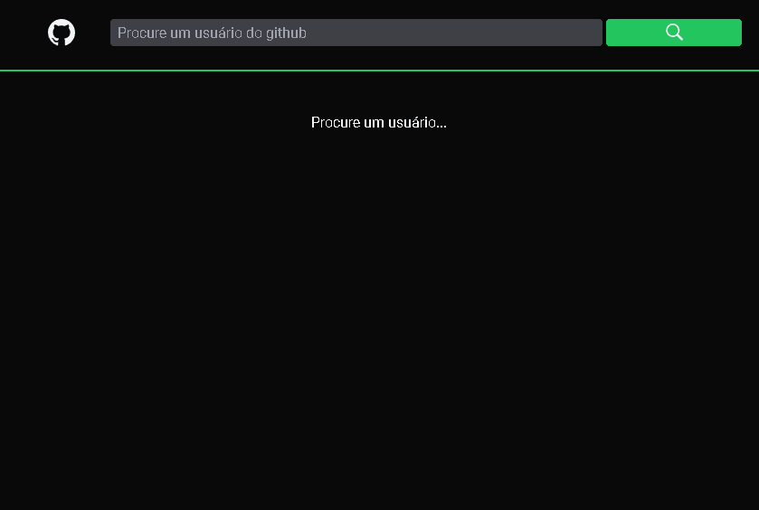

<div align='center'>
  
</div>

## Sobre o projeto 💬

O **SearchProfileGitHub** é uma aplicação WEB para pesquisar usuários do github, criado juntamente com a DIO

## Funcionalidades 🧠

A aplicação contém as seguintes funcionalidades:

- [x] Digitar Nome na barra de pesquisa para buscar o desenvolvedor e obter mais informações a respeito dele.

## Responsividade

<div align='center'>
  
</div>

## Pré-requisitos
#### Antes de começar, é bom ter instalado em sua maquina a seguinte ferramenta:
- [x] [GIT](https://git-scm.com/)
- [x] [VSCode](https://code.visualstudio.com/)
- [x] [NodeJs](https://nodejs.org/en/)

### Rodando o Projeto 📖

```bash
# Clone para este repositório
$ git clone <https://github.com/Pedro-AugusCoelho/SearchProfileGitHub.git>

# Acesse a pasta do projeto no terminal/cmd
$ cd SearchProfileGitHub

# Instale as dependências
$ mpm install / yarn

# Execute a aplicação em modo de desenvolvimento
$ npm run dev / yarn dev

# O servidor iniciará na porta:3000 - acesse <http://localhost:3000>
 
```

## Tecnologias 🛠

Desenvolvido utilizando as seguintes tecnologias:


- [REACT.JS](https://pt-br.reactjs.org/)
- [VITE](https://vitejs.dev/)
- [REACT-ROUTER](https://reactrouter.com/)
- [TYPESCRIPT](https://www.typescriptlang.org/)
- [AXIOS](https://www.npmjs.com/package/axios)
- [TAILWINDCSS](https://tailwindcss.com/)
- [REACT-ICONS](https://react-icons.github.io/react-icons/)

## Desenvolvido 💡

- Bootcamp Eduzz Fullstack Developer #3 na [DIO](https://www.dio.me/)

****************

<p align="center">Feito por: Pedro Augusto 🧑🏽🤙🏽</p>
