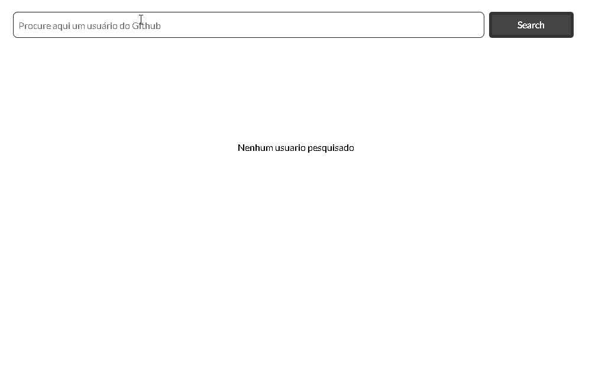

<div align='center'>
  
</div>

## Sobre o projeto 💬

O **SearchProfileGitHub** é uma aplicação WEB para pesquisar usuários do github para obter mais informações.

## Funcionalidades 🧠

A aplicação contém as seguintes funcionalidades:

### Index.tsx 📕

- [x] Digitar username na barra de pesquisa para acessar as informações
- [x] Poder escolher entre os repositories ou starred do usuário pesquisado
- [x] Site Responsivo.

## Pré-requisitos
#### Antes de começar, é bom ter instalado em sua maquina a seguinte ferramenta:
- [x] [GIT](https://git-scm.com/)
- [x] [VSCode](https://code.visualstudio.com/)
- [x] [NodeJs](https://nodejs.org/en/)

### Rodando o Projeto 📖

```bash
# Clone para este repositório
$ git clone <https://github.com/Pedro-AugusCoelho/SearchProfileGitHub.git>

# Acesse a pasta do projeto no terminal/cmd
$ cd SearchProfileGitHub

# Instale as dependências
$ npm/yarn install

# Execute a aplicação em modo de desenvolvimento
$ npm/yarn run start

# O servidor iniciará na porta:3000 - acesse <http://localhost:3000>
 
```

## Tecnologias 🛠

Desenvolvido utilizando as seguintes tecnologias:

- [HTML](https://www.w3schools.com/html/)
- [CSS3](https://www.w3schools.com/css/)
- [JAVASCRIPT](https://www.javascript.com/)
- [REACT.JS](https://pt-br.reactjs.org/)
- [TYPESCRIPT](https://www.typescriptlang.org/)
- [AXIOS](https://www.npmjs.com/package/axios)

****************

<p align="center">Feito por: Pedro Augusto 🧑🏽🤙🏽</p>
